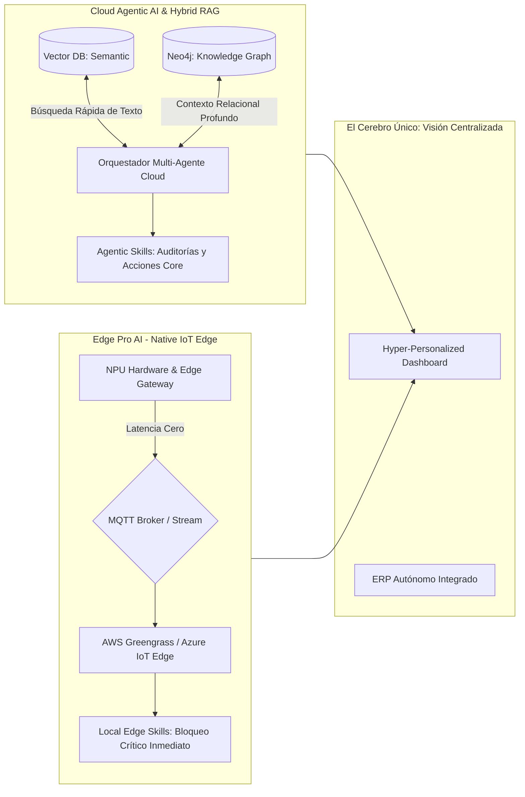

# Plan: Actualización Landing - El Futuro de la IA Agéntica y Edge AI (Keynote 2025)

## Visión Estratégica: Liderando la Vanguardia Tecnológica

El objetivo de esta actualización es dejar absolutamente claro que **Agentix Vanguard** no es solo otra plataforma de software o IA generativa, sino el **líder indiscutible en la próxima frontera de la Inteligencia Artificial: Agentic AI, Sistemas Hybrid RAG (Vector + Graph) y Edge-Cloud Synergy**. Debemos transmitir visual y textualmente un mensaje de *autonomía inteligente, hiper-personalización, baja latencia y colaboración multi-agente*, posicionando nuestro **Framework Propietario de Agentic Skills** y nuestra **Arquitectura Híbrida de Recuperación (Vectorial y Neo4j)** como las bases para decisiones complejas en 2025.

## Fuentes de Contenido

- **Keynote 2025** ([AI-Architecture-Keynote-2025.md](/Users/luisfelipesosa/git/agentixvanguard/Centinel-AI/AI-Architecture-Keynote-2025.md)):
  - **IA Agéntica vs Generativa**: De asistentes pasivos a agentes autónomos, auto-sanables (Self-Healing) impulsados por *Skills* configurables.
  - **Edge-Cloud Synergy & Modelos Livianos**: Modelos hiper-veloces (SLMs) ejecutándose on-device. Soporte de infraestructura IoT: AWS IoT Greengrass, Azure IoT Edge y GCP.
- **Producto estrella**: Gama Básica (Cloud-Based Agentic AI) vs Gama Alta (Edge Pro con NPU en dispositivo).
- **El Cerebro Único, Hybrid RAG & Agentic Skills**: Nuestra propia arquitectura de agentes (basada en *Skills* modulares) acoplada a una arquitectura **Hybrid RAG**. Empleamos tanto bases de datos vectoriales clásicas (para explorar grandes textos no estructurados) **como GraphRAG sobre Neo4j** (para extraer dependencias y contexto que el RAG vectorial por sí solo no ve).

---

## Cambios Propuestos

### 1. Nueva sección: "Nuestras Soluciones: Autonomía Cloud y Edge Pro"

Crear una sección destacada con tabla comparativa de las capacidades de Agentix Vanguard:

| Ubicación                                 | Ubicación en página | Descripción                         |
| ----------------------------------------- | ------------------- | ----------------------------------- |
| Después de LogoCloudSection / HeroSection | `Home.jsx`          | Nueva sección `ProductTiersSection` |

**Estructura del componente:**

- Header: *"Tu plataforma. Dos gamas. Un Cerebro Único Inteligente."*
- Dos cards/tabs premium: 
  - **Cloud-Based Agentic AI (Gama Básica)**: Flujos autónomos, capacidades generativas asistidas por *Hybrid RAG* y orquestación en la nube pública.
  - **Edge Pro AI (Gama Alta)**: Toma de decisiones en tiempo real, hardware NPU, Edge Gateways (AWS IoT / Azure IoT). Privacidad on-device.
- **Tabla comparativa**: Hardware, Inteligencia (Standard Vector RAG vs Hybrid Graph+Vector RAG), Conectividad (Cloud API vs Edge MQTT), Latencia.
- **CTA de upsell**: Empezar en la nube y escalar al Edge.
- **Bloque "Agentic Skills & Hybrid Intelligence"**: Destacar que nuestras *Skills Propietarias* toman decisiones alimentadas tanto por similitud semántica (Vectores) como por relaciones causales (*Neo4j*), procesando telemetría MQTT en vivo.

**Archivos:**

- Nuevo: `src/components/landing/ProductTiersSection.jsx`
- Traducciones: `src/locales/en.json`, `src/locales/es.json`

### 2. Nueva sección: "Intelligence Architecture: Hybrid RAG & Edge AI"

Crear `ArchAISection.jsx` (antiguo `EdgeAISection`) visualizando nuestros "cerebros":

- **Hybrid RAG (Vector + Graph powered by Neo4j)**: Explicar que la IA generativa estandarizada tiene déficits conectando puntos distantes. Usamos **ambos enfoques**. Vector RAG entrega velocidad al buscar políticas o grandes volúmenes de texto; GraphRAG (Neo4j) construye un mapa mental de la empresa con *relaciones* formales (Ej: "La máquina X fue operada por el usuario Y durante el reporte de error Z").
- **Sinergia Híbrida Inteligente IoT**: Cloud razona con contexto profundo (Grafos); Edge reacciona en tiempo real (MQTT/SLMs).
- **Agentic Skills Framework**: Motor modular propio, asegurando 100% de gobernanza sin depender de intermediarios de automatización.
- **Infraestructura Nativa de Nube**: Desplegable sobre AWS IoT Greengrass, Azure IoT Edge o GCP.

### 3. Actualizaciones a secciones existentes

**HeroSection** (traducciones `hero.`*):

- Menciones a **"Autonomous Multi-Agent Systems, Hybrid RAG Intelligence & Edge IoT"**.

**ServicesSection**:

- Especificar **MQTT, AWS Greengrass, Azure IoT**.
- Describir la potencia de las **"Agentic Skills"**.

**AITechSection**:

- Reemplazar menciones externas por: **"Agentic Skills Framework & Hybrid RAG (Vector + Neo4j)"**.
- Descripción: *Inteligencia semántica y relacional conjunta. Comprende el qué y el porqué con la unión de bases de datos vectoriales y conocimiento estructurado en grafos (Neo4j).*

**FAQSection**:

- Nueva pregunta: *"¿Por qué combinamos Vector RAG y GraphRAG (Neo4j) en nuestras soluciones?"*
- Nueva pregunta: *"¿Cómo despliegan agentes en mi hardware IoT (AWS/Azure) y qué son las 'Skills'?"*

### 4. Diagrama de Arquitectura de Vanguardia: Flujo de Producto (Hybrid RAG + Edge IoT)

### 5. Estructura de archivos y orden de secciones

Igual que el plan original, respetando `ArchAISection.jsx` y orden de renderizado propuesto.

---

## Parte C: Términos y Condiciones + Política de Privacidad

**Cláusulas Mandatorias (Blindaje Legal):**

1. **Autonomía, Hybrid RAG y Alucinaciones:** Exposición legal que aclara que los agentes de Agentix Vanguard ejecutan acciones mediante *Agentic Skills*, usando tanto RAG Vectorial como GraphRAG. Decisiones críticas exigen "Human in the Loop".
2. **Infraestructura Híbrida y Cloud Providers:** Aclarar las SLA en base a AWS IoT, Azure o GCP.
3. **Propiedad Intelectual y Entidad:** Todos los flujos y ontologías (Modelos de grafo de Neo4j) son del cliente/Agentix según acuerdo.

**Privacidad (Cumplimiento):**

1. **La Vanguardia en Privacidad vía Edge AI & Graph:** Beneficio de procesar telemetría local (on-device, AWS Greengrass), y mantener grafos anónimos.

---

**Nota Ejecutiva para Cursor AI:**
Por favor, ejecuta este plan. Integra el concepto de **Hybrid RAG** (ya no es un versus entre Vector y Grafo, sino que usamos lo mejor de los dos mundos: Vectores para documentos, Neo4j para relaciones), reemplazando el protocolo externo previo por **Agentic Skills Propietaria**. El diseño de los componentes debe ser *Dark Mode* corporativo y ultra-profesional.